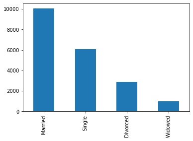

# Exploratory Data Analysis of Loan Application Data
## Introduction
This EDA is to explore the loan application data to see patterns of loan applicants.

## Data
This dataset was gotten from Kaggle. It contains 3000 rows and 20 columns. It is a loan application dataset that contains information about lenders':

**Personal information:** Age, Marital Status, Education Level, Employment Status, Job Tenure

**Financial status:** Annual Income, Monthly Income, Total Assets, Total Liabilities, Net Worth

**Credit behavior:** Credit Score, Credit Card Utilization, Debt-to-Income Ratio, Number of Credit Lines


Loan details: Loan Amount, Duration, Purpose, Interest Rate, Base Interest Rate


Behavioral history: Payment History, Bankruptcy History, Previous Defaults, Utility Bills Payment History

I read in the dataset using:
```
import pandas as pd

de = pd.read_excel('Loan.xlsx')
de.head()
```

## Data Cleaning
I performed a data quality check to ensure it is clean and ready for analysis.
These were the data issues I found and rectified
1. **Missing Values:**

I used: ``` de.isnull().sum() ``` to find the columns that had missing values and the total number of missing values. I found them in the following columns:
```
staff_id      0
staff_name    1
age           6
gender        0
join_date     0
currency      5
salary        5
state         4
dept_id       0
dept_name     0
d_o_b         0
dtype: int64
```

I rectified the missing rows in the age column by extracting the year from the D.O.B column and subtracting it from the current year (2025).
```
workers['year'] = workers['d_o_b'].dt.year
workers.loc[workers['age'].isnull(), 'age'] = 2025 - workers['year']
```

2. **Duplicate Values:**

I used: ``` de[de.duplicated(keep=False)] ``` to find duplicate rows and found the following:
```
staff_id      staff_name  age gender  join_date currency    salary   state  \
19     W020   Joseph Stuart   45   Male 2019-06-24      NGN  120632.0  Rivers   
47     W048    Gerald Davis   29   Male 2023-06-20      NGN  194232.0     Oyo   
48     W049  Maureen Thomas   57   Male 2024-08-24      NGN  120280.0  Kaduna   
49     W050  Charles Ingram   40   Male 2020-08-08      NGN  165492.0   Lagos   
50     W048    Gerald Davis   29   Male 2023-06-20      NGN  194232.0     Oyo   
51     W049  Maureen Thomas   57   Male 2024-08-24      NGN  120280.0  Kaduna   
52     W050  Charles Ingram   40   Male 2020-08-08      NGN  165492.0   Lagos   
53     W020   Joseph Stuart   45   Male 2019-06-24      NGN  120632.0  Rivers   

    dept_id           dept_name      d_o_b  year  
19        9          Operations 1980-05-14  1980  
47        8               Legal 1996-11-26  1996  
48       10  Product Management 1968-01-01  1968  
49        3         Engineering 1985-01-16  1985  
50        8               Legal 1996-11-26  1996  
51       10  Product Management 1968-01-01  1968  
52        3         Engineering 1985-01-16  1985  
53        9          Operations 1980-05-14  1980
```

## Univariate Analysis & Insights

### Categorical Variable
These are the categorical columns I performed univariate analysis on: Marital Status, etc.
I did a frequency count for the Marital Status column using:
```
import matplotlib.pyplot as plt
import seaborn as sns

de['MaritalStatus'].value_counts()
```
**Result:**
```
Married     10041
Single       6078
Divorced     2882
Widowed       999
Name: MaritalStatus, dtype: int64
```

### Visualization
**Bar Chart:**
```
de['MaritalStatus'].value_counts().plot(kind='bar')
plt.show()
```
**Result:**

